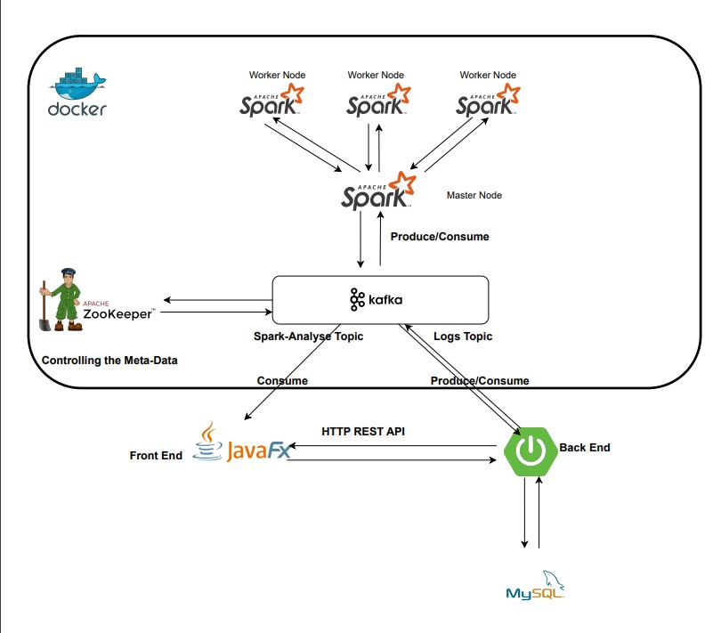
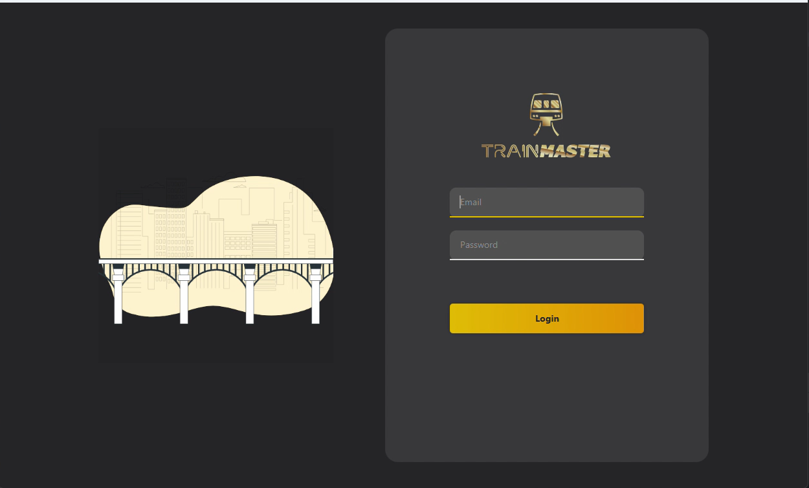
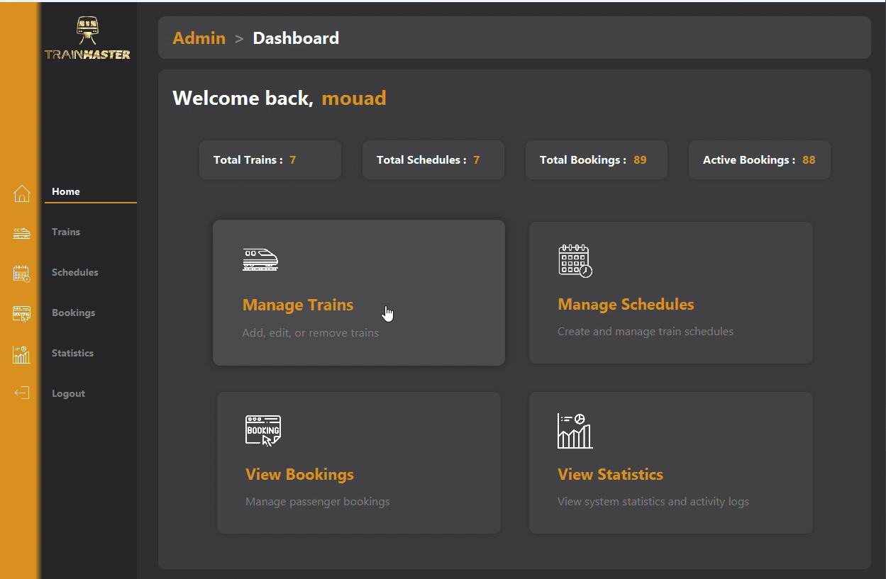
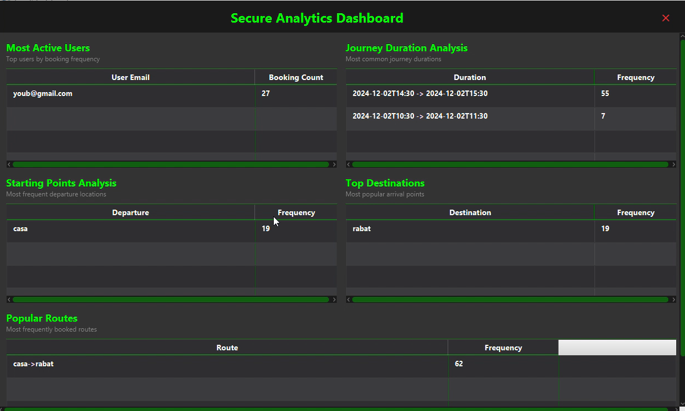
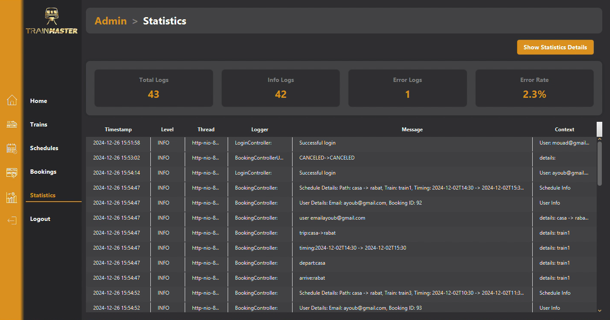
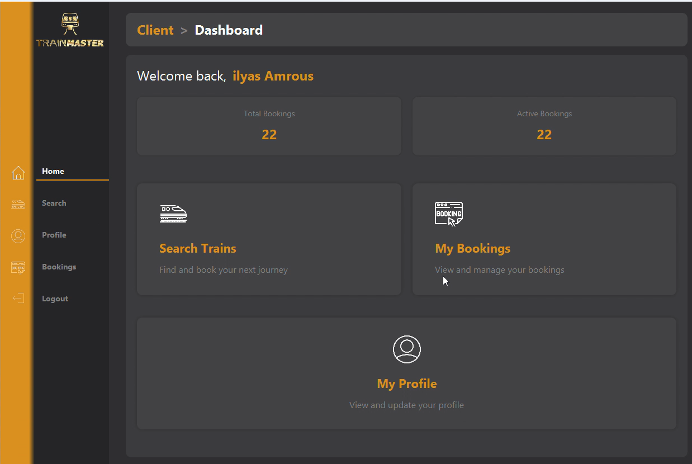

# Train Scheduling System with Real-Time Analytics 🚂


A comprehensive train scheduling and management system leveraging real-time data streaming for instant analytics and seamless booking experiences.

## Project Demo







## Features

### Client Features
- User profile management
- Real-time train schedule viewing
- Reservation booking system
- Reservation management (CRUD)
- Live booking status updates

### Admin Features
- Train management (CRUD operations)
- Schedule management
- Real-time analytics dashboard
- Live log monitoring
- Kafka stream monitoring

## Technology Stack

- **Frontend**: JavaFX 21
- **Backend**: Spring Boot 3.3.5
- **Security**: Spring Security
- **Data Processing**: Apache Spark Streaming
- **Message Broker**: Apache Kafka
- **Database**: MySQL
- **Build Tool**: Maven
- **Container**: Docker & Docker Compose

The system implements a streaming-first architecture where:
1. Spring Boot backend produces logs and events to Kafka topics
2. Spark Streaming processes these events in real-time
3. Analysis results are published to dedicated Kafka topics
4. JavaFX frontend consumes both REST API data and Kafka analytics

## Prerequisites

- Java Development Kit (JDK) 21
- Docker and Docker Compose
- IntelliJ IDEA (recommended)
- Maven 3.8+
- Git

## Installation & Setup

1. Clone the repository
```bash
git clone https://github.com/mouadayoub1971/TrainSchedules.git
cd TrainSchedules
```

2. Configure environment variables
```bash
cp .application.txt .application.yml
# Edit .application.yml file with your configurations
```

3. Build the project
```bash
mvn clean install
```

4. Start the services using Docker Compose
```bash
docker-compose up -d
```


## Running the Application

### Using IntelliJ IDEA
1. Open the project in IntelliJ IDEA
2. Start the required services:
```bash
docker-compose up 
```
3. Run the Spring Boot application
4. Run the JavaFX client application

### Using Docker Compose
```bash
docker-compose up -d
```

## Development

1. Start the backend server:
```bash
cd backend
mvn spring-boot:run
```

2. Start the frontend application:
```bash
cd frontend
mvn javafx:run
```

## Contributing

1. Fork the repository
2. Create your feature branch (`git checkout -b feature/amazing-feature`)
3. Commit your changes (`git commit -m 'Add some amazing feature'`)
4. Push to the branch (`git push origin feature/amazing-feature`)
5. Open a Pull Request


## Contact & Social

- LinkedIn: https://www.linkedin.com/in/mouad-ayoub-255a50304?utm_source=share&utm_campaign=share_via&utm_content=profile&utm_medium=android_app
- Project Link: https://x.com/AyoubMouad1971?t=Z9nNHzSk9j2oXRLeble7gg&s=09

## Acknowledgments

- Apache Spark Documentation
- Apache Kafka Documentation
- Spring Boot Documentation
- JavaFX Community

---
Made with ❤️ by Mouad Ayoub